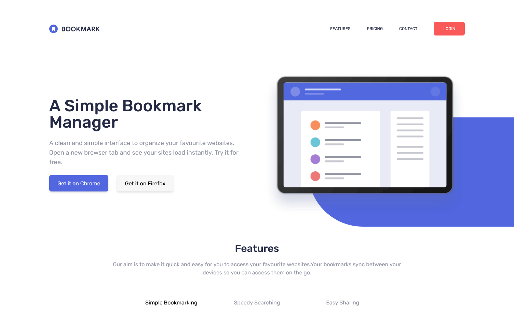

# Frontend Mentor - Bookmark landing page solution

This is a solution to the [Bookmark landing page challenge on Frontend Mentor](https://www.frontendmentor.io/challenges/bookmark-landing-page-5d0b588a9edda32581d29158). Frontend Mentor challenges help you improve your coding skills by building realistic projects. 

## Table of contents

- [Overview](#overview)
  - [The challenge](#the-challenge)
  - [Screenshot](#screenshot)
  - [Links](#links)
- [My process](#my-process)
  - [Built with](#built-with)
  - [What I learned](#what-i-learned)
  - [Continued development](#continued-development)
  - [Useful resources](#useful-resources)
- [Author](#author)
- [Acknowledgments](#acknowledgments)

**Note: Delete this note and update the table of contents based on what sections you keep.**

## Overview

### The challenge

Users should be able to:

- View the optimal layout for the site depending on their device's screen size
- See hover states for all interactive elements on the page
- Receive an error message when the newsletter form is submitted if:
  - The input field is empty
  - The email address is not formatted correctly

### Screenshot

### Links

- Solution URL: [Add solution URL here](https://your-solution-url.com)
- Live Site URL: [https://ornate-hummingbird-bee68b.netlify.app/](https://ornate-hummingbird-bee68b.netlify.app/)

## My process

### Built with

- Semantic HTML5 markup
- CSS custom properties
- Flexbox
- Mobile-first workflow
- [React](https://reactjs.org/) - JS library
- [Next.js](https://nextjs.org/) - React framework
- [Tailwindcss](https://tailwindcss.com/) - For styles

### What I learned

My main focus on completing this project was to practice my skills and knowledge around Next Js and Tailwindcss (without having to design). One of the main features I really enjoyed working on in this project was the Features section, making use of State in React and updating the rendering component based on the selected feature.  

### Continued development

For continued development I would take this frontend and attach it to some sort of Content Management System. This would allow users to make updates for their content when needed. I would take the JAMStack approach, using a headless CMS (such as Sanity.io).

### Useful resources

- [Tailwindcss Docs](https://tailwindcss.com/docs/installation) - Tailwindcss Docs is extremely useful trying to figure out the best styles to use, easy to find what you need.

## Author

- Website - [Personal Website](https://richardgriffiths-portfolio.netlify.app/)
- Frontend Mentor - [@RichGriff](https://www.frontendmentor.io/profile/RichGriff)

